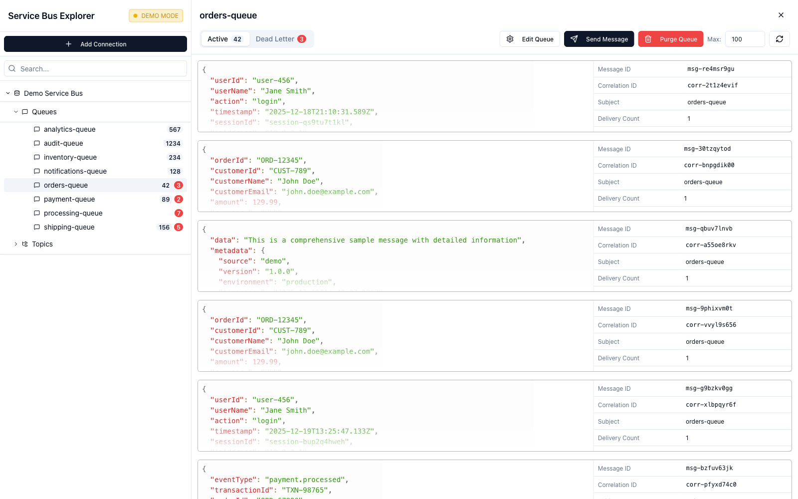

# Azure Service Bus Explorer

A powerful, intuitive desktop application for managing and monitoring your Azure Service Bus infrastructure. Debug message queues, manage topics and subscriptions, and test your messaging workflows with a beautiful, native interface.

---

## Download & Install

### macOS App Store
**Download from the Mac App Store** - Coming soon!

### Direct Download
**[Download Latest Release](https://github.com/Bishoymly/servicebusexplorer/releases)** - Get installers for Windows, macOS, and Linux

### Build from Source
For developers: See [BUILD.md](BUILD.md) for build instructions.

---

## Key Features

- **Multi-Connection Management** - Save and switch between multiple Azure Service Bus connections with connection strings or Azure AD authentication
- **Queue Management** - Browse, search, create, edit, and delete queues with real-time message counts and metrics
- **Topic & Subscription Management** - Manage topics and subscriptions with full control over properties and filters
- **Message Operations** - Peek, send, resend, and inspect messages. Access dead letter queues and purge queues when needed
- **Beautiful Native Interface** - Apple-inspired design with dark mode support, available on Windows, macOS, and Linux
- **Fast & Lightweight** - Built with Tauri for minimal resource usage and instant performance

---

## Perfect For

Developers debugging integrations, DevOps engineers monitoring queues, QA teams testing workflows, and support teams troubleshooting message delivery issues.

---

## Quick Start

1. **Download** the app from the [Releases](https://github.com/Bishoymly/servicebusexplorer/releases) page or Mac App Store
2. **Launch** and add your Azure Service Bus connection (connection string or Azure AD)
3. **Explore** your queues and topics, peek messages, and manage your Service Bus infrastructure

---

## Security & Privacy

- All connection data stored locally on your device
- No data sent to third-party servers
- Direct connection to your Azure Service Bus namespace
- Supports Azure AD authentication

---

## System Requirements

- **macOS**: macOS 10.13 or later
- **Windows**: Windows 10 or later
- **Linux**: Ubuntu 18.04+ / Debian 10+ / Fedora 32+ / Arch Linux

---

## Contributing

Contributions are welcome! Please feel free to submit a Pull Request.

## License

MIT License - see the LICENSE file for details.

## Support

- **Issues**: [GitHub Issues](https://github.com/Bishoymly/servicebusexplorer/issues)
- **Documentation**: [Wiki](https://github.com/Bishoymly/servicebusexplorer/wiki)

---

**Made with love for the Azure community**
